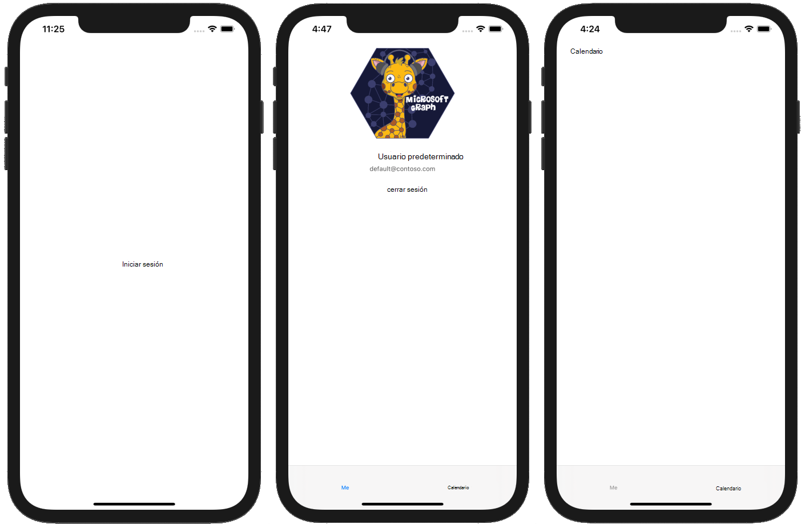

<!-- markdownlint-disable MD002 MD041 -->

Para empezar, cree un nuevo proyecto SWIFT.

1. Abra Xcode. En el menú **archivo** , seleccione **nuevo**y, a continuación, **proyecto**.
1. Elija la plantilla **aplicación de vista única** y seleccione **siguiente**.

    

1. Establezca el **nombre** del producto `GraphTutorial` en y el **idioma** en **SWIFT**.
1. Rellene los campos restantes y seleccione **siguiente**.
1. Elija una ubicación para el proyecto y seleccione **crear**.

## <a name="install-dependencies"></a>Instalar dependencias

Antes de continuar, instale algunas dependencias adicionales que usará más adelante.

- [Biblioteca de autenticación de Microsoft (MSAL) para iOS](https://github.com/AzureAD/microsoft-authentication-library-for-objc) para la autenticación con Azure ad.
- [SDK de Microsoft Graph para Objective C](https://github.com/microsoftgraph/msgraph-sdk-objc) para realizar llamadas a Microsoft Graph.
- El [SDK de modelos de Microsoft Graph para Objective C](https://github.com/microsoftgraph/msgraph-sdk-objc-models) para objetos con establecimiento inflexible de tipos que representan recursos de Microsoft Graph, como usuarios o eventos.

1. Salga de Xcode.
1. Abra terminal y cambie el directorio a la ubicación del proyecto de **GraphTutorial** .
1. Ejecute el siguiente comando para crear un Podfile.

    ```Shell
    pod init
    ```

1. Abra Podfile y agregue las siguientes líneas justo después de la `use_frameworks!` línea.

    ```Ruby
    pod 'MSAL', '~> 1.0.2'
    pod 'MSGraphClientSDK', ' ~> 1.0.0'
    pod 'MSGraphClientModels', '~> 1.3.0'
    ```

1. Guarde la Podfile y, a continuación, ejecute el siguiente comando para instalar las dependencias.

    ```Shell
    pod install
    ```

1. Una vez que se complete el comando, abra el **GraphTutorial. xcworkspace** recién creado en Xcode.

## <a name="design-the-app"></a>Diseñar la aplicación

En esta sección, creará las vistas de la aplicación: una página de inicio de sesión, un explorador de barras de pestañas, una página de bienvenida y una página de calendario. También creará una superposición del indicador de actividad.

### <a name="create-sign-in-page"></a>Página de creación de inicio de sesión

1. Expanda la carpeta **GraphTutorial** en Xcode y, a continuación, seleccione **ViewController. SWIFT**.
1. En el **Inspector de archivos**, cambie el **nombre** del archivo a `SignInViewController.swift`.

    

1. Abra **SignInViewController. SWIFT** y reemplace su contenido por el código siguiente.

    ```Swift
    import UIKit

    class SignInViewController: UIViewController {

        override func viewDidLoad() {
            super.viewDidLoad()
            // Do any additional setup after loading the view.
        }

        @IBAction func signIn() {
            self.performSegue(withIdentifier: "userSignedIn", sender: nil)
        }
    }
    ```

1. Abra el archivo **Main. Storyboard** .
1. Expanda **View Controller Scene**y, a continuación, seleccione **View Controller**.

    

1. Seleccione el **Inspector de identidad**y, a continuación, cambie el desplegable de **clase** a **SignInViewController**.

    

1. Seleccione la **biblioteca**y, a continuación, arrastre un **botón** hasta el **controlador de vista de inicio de sesión**.

    

1. Con el botón seleccionado, seleccione el **Inspector de atributos** y cambie el **título** del botón a `Sign In`.

    

1. Seleccione el **controlador de vista de inicio de sesión**y, a continuación, seleccione el **Inspector de conexiones**.
1. En **acciones recibidas**, arrastre el círculo no rellenado junto a **iniciar sesión** en el botón. Seleccione **retocar dentro** del menú emergente.

    

1. En el menú **Editor** , seleccione **resolver problemas de diseño automático**y, a continuación, seleccione **Agregar restricciones que faltan** debajo **de todas las vistas en el controlador de vista de inicio de sesión**.

### <a name="create-tab-bar"></a>Crear barra de pestañas

1. Seleccione la **biblioteca**y, a continuación, arrastre un **controlador de barra de pestañas** hasta el guión gráfico.
1. Seleccione el **controlador de vista de inicio de sesión**y, a continuación, seleccione el **Inspector de conexiones**.
1. En **segues desencadenados**, arrastre el círculo no rellenado junto a **manual** en el controlador de la **barra de pestañas** del guión gráfico. Seleccione **presente** de forma modal en el menú emergente.

    

1. Seleccione el segue que acaba de agregar y, a continuación, seleccione el **Inspector de atributos**. Establezca el campo **identificador** en `userSignedIn`y establezca **presentación** en **pantalla completa**.

    

1. Seleccione la **escena elemento 1**y, a continuación, seleccione el **Inspector de conexiones**.
1. En **segues desencadenados**, arrastre el círculo no rellenado junto a **manual** en el **controlador de vista de inicio de sesión** del guión gráfico. Seleccione **presente** de forma modal en el menú emergente.
1. Seleccione el segue que acaba de agregar y, a continuación, seleccione el **Inspector de atributos**. Establezca el campo **identificador** en `userSignedOut`y establezca **presentación** en **pantalla completa**.

### <a name="create-welcome-page"></a>Crear Página principal

1. Seleccione el archivo **assets. xcassets** .
1. En el menú **Editor** , seleccione **Agregar activos**y, a continuación, **nuevo conjunto de imágenes**.
1. Seleccione el nuevo recurso de **imagen** y use el **Inspector de atributos** para establecer su `DefaultUserPhoto` **nombre** en.
1. Agregue cualquier imagen que quiera que sirva como una foto de Perfil de usuario predeterminada.

    

1. Cree un nuevo archivo de **clase táctil de cacao** en la carpeta `WelcomeViewController` **GraphTutorial** denominada. Elija **UIViewController** en el campo **subclase de** .
1. Abra **WelcomeViewController. SWIFT** y reemplace su contenido por el código siguiente.

    ```Swift
    import UIKit

    class WelcomeViewController: UIViewController {

        @IBOutlet var userProfilePhoto: UIImageView!
        @IBOutlet var userDisplayName: UILabel!
        @IBOutlet var userEmail: UILabel!

        override func viewDidLoad() {
            super.viewDidLoad()

            // Do any additional setup after loading the view.

            // TEMPORARY
            self.userProfilePhoto.image = UIImage(imageLiteralResourceName: "DefaultUserPhoto")
            self.userDisplayName.text = "Default User"
            self.userEmail.text = "default@contoso.com"
        }

        @IBAction func signOut() {
            self.performSegue(withIdentifier: "userSignedOut", sender: nil)
        }
    }
    ```

1. Abra **Main. Storyboard**. Seleccione la **escena elemento 1**y, a continuación, seleccione el **Inspector de identidad**. Cambie el valor de la **clase** a **WelcomeViewController**.
1. Mediante el uso de la **biblioteca**, agregue los siguientes elementos a la **escena elemento 1**.

    - Una **vista de imagen**
    - Dos **etiquetas**
    - Un **botón**

1. Seleccione la vista de imagen y, a continuación, seleccione el **Inspector de tamaño**.
1. Establezca el **ancho** y el **alto** en 196.
1. Seleccione la segunda etiqueta y, a continuación, seleccione el **Inspector de atributos**.
1. Cambie el **color** a **color gris oscuro**y cambie la **fuente** a **sistema 12,0**.
1. Seleccione el botón y, a continuación, seleccione el **Inspector de atributos**.
1. Cambie el **título** a `Sign Out`.
1. Mediante el **Inspector de conexiones**, realice las siguientes conexiones.

    - Vincule el tomacorriente **userDisplayName** a la primera etiqueta.
    - Vincule la toma de **userEmail** a la segunda etiqueta.
    - Vincule el tomacorriente **userProfilePhoto** a la vista de imagen.
    - Vincular la acción de **signOut** recibido a la **pantalla táctil**del botón en.

1. Seleccione el elemento de la barra de pestañas en la parte inferior de la escena y, a continuación, seleccione el **Inspector de atributos**. Cambie el **título** a `Me`.
1. En el menú **Editor** , seleccione **resolver problemas de diseño automático**y, a continuación, seleccione **Agregar restricciones que faltan** debajo **de todas las vistas en el controlador de vista de bienvenida**.

La escena de bienvenida debe tener una apariencia similar a la siguiente una vez que haya terminado.


### <a name="create-calendar-page"></a>Crear página de calendario

1. Cree un nuevo archivo de **clase táctil de cacao** en la carpeta `CalendarViewController` **GraphTutorial** denominada. Elija **UIViewController** en el campo **subclase de** .
1. Abra **CalendarViewController. SWIFT** y reemplace su contenido por el código siguiente.

    ```Swift
    import UIKit

    class CalendarViewController: UIViewController {

        @IBOutlet var calendarJSON: UITextView!

        override func viewDidLoad() {
            super.viewDidLoad()

            // Do any additional setup after loading the view.

            // TEMPORARY
            calendarJSON.text = "Calendar"
            calendarJSON.sizeToFit()
        }
    }
    ```

1. Abra **Main. Storyboard**. Seleccione la **escena elemento 2**y, a continuación, seleccione el **Inspector de identidad**. Cambie el valor de la **clase** a **CalendarViewController**.
1. Con la **biblioteca**, agregue una **vista de texto** a la **escena del elemento 2**.
1. Seleccione la vista de texto que acaba de agregar. En el **Editor**, elija **incrustar en**y, a continuación, **vista de desplazamiento**.
1. Mediante el **Inspector de conexiones**, conecte el tomacorriente **calendarJSON** a la vista de texto.
1. 1. Seleccione el elemento de la barra de pestañas en la parte inferior de la escena y, a continuación, seleccione el **Inspector de atributos**. Cambie el **título** a `Calendar`.
1. En el menú **Editor** , seleccione **resolver problemas de diseño automático**y, a continuación, seleccione **Agregar restricciones que faltan** debajo **de todas las vistas en el controlador de vista de bienvenida**.

La escena del calendario debe tener un aspecto similar a este, una vez que haya terminado.


### <a name="create-activity-indicator"></a>Crear indicador de actividad

1. Cree un nuevo archivo de **clase táctil de cacao** en la carpeta `SpinnerViewController` **GraphTutorial** denominada. Elija **UIViewController** en el campo **subclase de** .
1. Abra **SpinnerViewController. SWIFT** y reemplace su contenido por el código siguiente.

    ```Swift
    import UIKit

    class SpinnerViewController: UIViewController {

        var spinner = UIActivityIndicatorView(style: .whiteLarge)

        override func loadView() {
            view = UIView()
            view.backgroundColor = UIColor(white: 0, alpha: 0.7)

            spinner.translatesAutoresizingMaskIntoConstraints = false
            spinner.startAnimating()
            view.addSubview(spinner)

            spinner.centerXAnchor.constraint(equalTo: view.centerXAnchor).isActive = true
            spinner.centerYAnchor.constraint(equalTo: view.centerYAnchor).isActive = true
        }

        public func start(container: UIViewController) {
            container.addChild(self)
            self.view.frame = container.view.frame
            container.view.addSubview(self.view)
            self.didMove(toParent: container)
        }

        public func stop() {
            self.willMove(toParent: nil)
            self.view.removeFromSuperview()
            self.removeFromParent()
        }
    }
    ```

## <a name="test-the-app"></a>Probar la aplicación

Guarde los cambios e inicie la aplicación. Debe poder moverse entre las pantallas con los botones **iniciar sesión** y **Cerrar sesión** y la barra de pestañas.


