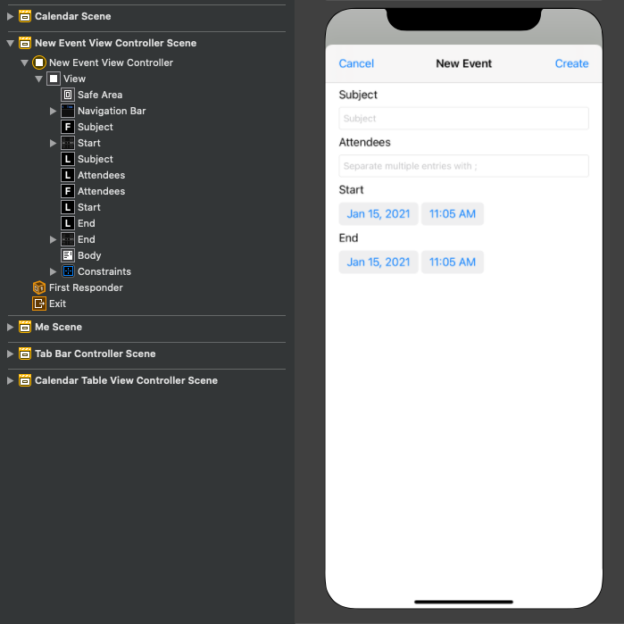

<!-- markdownlint-disable MD002 MD041 -->

En esta sección agregará la capacidad de crear eventos en el calendario del usuario.

1. Abra **GraphManager.swift** y agregue la siguiente función para crear un nuevo evento en el calendario del usuario.

    :::code language="swift" source="../demo/GraphTutorial/GraphTutorial/GraphManager.swift" id="CreateEventSnippet":::

1. Cree un nuevo **archivo de clase Cocoa Touch** en la carpeta **GraphTutorial** denominada `NewEventViewController` . Elija **UIViewController** en la **subclase del** campo.
1. Abra **NewEventViewController.swift** y reemplace su contenido por lo siguiente.

    :::code language="swift" source="../demo/GraphTutorial/GraphTutorial/NewEventViewController.swift" id="NewEventViewControllerSnippet":::

1. Abra **Main.storyboard**. Usa la **biblioteca para** arrastrar un controlador **de vista** al guión gráfico.
1. Mediante la **biblioteca,** agregue una **barra de navegación** al controlador de vista.
1. Haga doble clic en **el título** de la barra de navegación y actualíquelo a `New Event` .
1. Mediante la **biblioteca,** agregue un elemento **de botón** de barra a la izquierda de la barra de navegación.
1. Seleccione el botón nueva barra y, a continuación, seleccione el **Inspector de atributos**. Cambiar **título** a `Cancel` .
1. Mediante la **biblioteca,** agregue un elemento **de botón** de barra a la derecha de la barra de navegación.
1. Seleccione el botón nueva barra y, a continuación, seleccione el **Inspector de atributos.** Cambiar **título** a `Create` .
1. Seleccione el controlador de vista y, a continuación, seleccione **el Inspector de identidad.** Cambiar **clase** a **NewEventViewController**.
1. Agregue los siguientes controles de la **biblioteca** a la vista.

    - Agregue una **etiqueta debajo** de la barra de navegación. Establezca su texto en `Subject` .
    - Agregue un **campo de texto** bajo la etiqueta. Establezca su atributo **placeholder** en `Subject` .
    - Agregue una **etiqueta bajo** el campo de texto. Establezca su texto en `Attendees` .
    - Agregue un **campo de texto** bajo la etiqueta. Establezca su **atributo Placeholder** en `Separate multiple entries with ;` .
    - Agregue una **etiqueta bajo** el campo de texto. Establezca su texto en `Start` .
    - Agregue un **selector de fecha** bajo la etiqueta. Establezca su **estilo preferido en** **Compacto**, su **intervalo** **en 15** minutos y su alto en **35**.
    - Agregue una **etiqueta bajo** el selector de fecha. Establezca su texto en `End` .
    - Agregue un **selector de fecha** bajo la etiqueta. Establezca su **estilo preferido en** **Compacto**, su **intervalo** **en 15** minutos y su alto en **35**.
    - Agregue una **vista de texto bajo** el selector de fecha.

1. Seleccione el **nuevo controlador de vista de eventos** y use el Inspector **de** conexión para realizar las siguientes conexiones.

    - Conecte la **acción de** cancelación recibida al **botón Cancelar** barra.
    - Conecte la **acción createEvent** recibida al **botón Crear** barra.
    - Conecte la **salida del asunto** al primer campo de texto.
    - Conecte la **salida de asistentes** al segundo campo de texto.
    - Conecta la **salida de** inicio al primer selector de fecha.
    - Conecte la **salida final** al segundo selector de fecha.
    - Conecte la **salida del** cuerpo a la vista de texto.

1. Agregue las siguientes restricciones.

    - **Barra de navegación**
        - Espacio inicial a Área segura, valor: 0
        - Espacio final a Área segura, valor: 0
        - Espacio superior a Área segura, valor: 0
        - Alto, valor: 44
    - **Etiqueta de asunto**
        - Espacio inicial para ver margen, valor: 0
        - Espacio final para ver margen, valor: 0
        - Espacio superior a barra de navegación, valor: 20
    - **Campo de texto del asunto**
        - Espacio inicial para ver margen, valor: 0
        - Espacio final para ver margen, valor: 0
        - Espacio superior a Etiqueta de asunto, valor: Estándar
    - **Etiqueta de asistentes**
        - Espacio inicial para ver margen, valor: 0
        - Espacio final para ver margen, valor: 0
        - Espacio superior al campo texto del asunto, valor: Estándar
    - **Campo de texto Attendees**
        - Espacio inicial para ver margen, valor: 0
        - Espacio final para ver margen, valor: 0
        - Espacio superior a Etiqueta de asistentes, valor: Estándar
    - **Etiqueta de inicio**
        - Espacio inicial para ver margen, valor: 0
        - Espacio final para ver margen, valor: 0
        - Espacio superior al campo de texto del asunto, valor: Estándar
    - **Selector de fecha de inicio**
        - Espacio inicial para ver margen, valor: 0
        - Espacio final para ver margen, valor: 0
        - Espacio superior a Etiqueta de asistentes, valor: Estándar
        - Alto, valor: 35
    - **Etiqueta final**
        - Espacio inicial para ver margen, valor: 0
        - Espacio final para ver margen, valor: 0
        - Espacio superior al Selector de fecha de inicio, valor: Estándar
    - **Selector de fecha de finalización**
        - Espacio inicial para ver margen, valor: 0
        - Espacio final para ver margen, valor: 0
        - Espacio superior a Etiqueta final, valor: Estándar
        - Alto: 35
    - **Vista texto del cuerpo**
        - Espacio inicial para ver margen, valor: 0
        - Espacio final para ver margen, valor: 0
        - Espacio superior al selector de fecha de finalización, valor: Estándar
        - Espacio inferior para ver margen, valor: 0

    

1. Seleccione la escena **de calendario** y, a continuación, seleccione el Inspector **de conexiones**.
1. En **Segues desencadenado,** arrastra el círculo sin rellenar junto a **manual** al nuevo controlador de vista **de eventos** en el guión gráfico. Seleccione **Presentar modalmente** en el menú emergente.
1. Seleccione el segue que acaba de agregar y, a continuación, seleccione el **Inspector de atributos.** Establezca el **campo Identificador** en `showEventForm` .
1. Conecte la **acción recibida showNewEventForm** al botón **+** de la barra de navegación.
1. Guarde los cambios y reinicie la aplicación. Ve a la página del calendario y pulsa el **+** botón. Rellene el formulario y pulse **Crear** para crear un nuevo evento.

    
